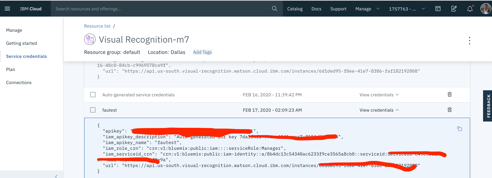

*Quick links :*
[Home](/README.md) - [Watson Visual](/WatsonVisual.md)
# Programming ESP32 Camera 

In this tutorial you will learn how to capture a picture from your ESP32-CAM and use the free IBM Watson Visual Recognition service to classify the objects on the picture.

## Parts used for this tutorial

- ESP32-CAM with OV2640 camera module
- Female to female jumpers (6 of them)
- The ESP32-CAM doesn’t come with a USB connector, so you need an FTDI programmer to upload code through the U0R and U0T pins. 

This part assumes you have completed the first lab [Getting Started](/GettingStarted.md) and had an IBM Cloud account created (https://cloud.ibm.com)

## Create a Watson Visual Studio service

Go here https://cloud.ibm.com/catalog and search for `Visual Recognition`, click on the found service in that catalog search and follow the steps to create a `Watson Visual Recognition` service.

Once the service's been created, access the service page, and navigate to `Service credentials` menu item on the left to create a `New credential`



Record the `apikey` and `url` for later (eg: `https://api.us-south.visual-recognition.watson.cloud.ibm.com`)

## Code 

Now in your Arduino IDE, create a new Sketch with this code and replace the placeholder values by yours. This code takes picture using the ESP32-CAM every 5 seconds and send it to Watson Visual Recognition service to classify the objects in the pic. 

The responding result from Watson will be printed to the `Serial monitor` 

You can plug this piece of code into your solution to make use of Watson service, for example, by parsing the Json sent back by Watson and process it further. 

```C
#include "esp_http_client.h"
#include "esp_camera.h"
#include <WiFi.h>
#include "Arduino.h"

const char* ssid = "[Your-Wifi-SSID]";
const char* password = "[Your-Wifi-pass]";

// Watson Visual Recognition service endpoint. This use the domain part in the service's url
const char *post_url = "https://[YOUR-SERVICE-DOMAIN/v3/classify?version=2018-03-19]"; 

bool internet_connected = false;

#define PWDN_GPIO_NUM     32
#define RESET_GPIO_NUM    -1
#define XCLK_GPIO_NUM      0
#define SIOD_GPIO_NUM     26
#define SIOC_GPIO_NUM     27
#define Y9_GPIO_NUM       35
#define Y8_GPIO_NUM       34
#define Y7_GPIO_NUM       39
#define Y6_GPIO_NUM       36
#define Y5_GPIO_NUM       21
#define Y4_GPIO_NUM       19
#define Y3_GPIO_NUM       18
#define Y2_GPIO_NUM        5
#define VSYNC_GPIO_NUM    25
#define HREF_GPIO_NUM     23
#define PCLK_GPIO_NUM     22

void setup()
{
  Serial.begin(115200);

  if (init_wifi()) { 
    internet_connected = true;
    Serial.println("Internet connected");
  }

  camera_config_t config;
  config.ledc_channel = LEDC_CHANNEL_0;
  config.ledc_timer = LEDC_TIMER_0;
  config.pin_d0 = Y2_GPIO_NUM;
  config.pin_d1 = Y3_GPIO_NUM;
  config.pin_d2 = Y4_GPIO_NUM;
  config.pin_d3 = Y5_GPIO_NUM;
  config.pin_d4 = Y6_GPIO_NUM;
  config.pin_d5 = Y7_GPIO_NUM;
  config.pin_d6 = Y8_GPIO_NUM;
  config.pin_d7 = Y9_GPIO_NUM;
  config.pin_xclk = XCLK_GPIO_NUM;
  config.pin_pclk = PCLK_GPIO_NUM;
  config.pin_vsync = VSYNC_GPIO_NUM;
  config.pin_href = HREF_GPIO_NUM;
  config.pin_sscb_sda = SIOD_GPIO_NUM;
  config.pin_sscb_scl = SIOC_GPIO_NUM;
  config.pin_pwdn = PWDN_GPIO_NUM;
  config.pin_reset = RESET_GPIO_NUM;
  config.xclk_freq_hz = 20000000;
  config.pixel_format = PIXFORMAT_JPEG;

  if (psramFound()) {
    config.frame_size = FRAMESIZE_UXGA;
    config.jpeg_quality = 10;
    config.fb_count = 2;
  } else {
    config.frame_size = FRAMESIZE_SVGA;
    config.jpeg_quality = 12;
    config.fb_count = 1;
  }

  // camera init
  esp_err_t err = esp_camera_init(&config);
  if (err != ESP_OK) {
    Serial.printf("Camera init failed with error 0x%x", err);
    return;
  }
}

bool init_wifi()
{
  int connAttempts = 0;
  Serial.println("\r\nConnecting to: " + String(ssid));
  WiFi.begin(ssid, password);
  while (WiFi.status() != WL_CONNECTED ) {
    delay(500);
    Serial.print(".");
    if (connAttempts > 10) return false;
    connAttempts++;
  }
  return true;
}

/*
Handling the http events. Take close look at HTTP_EVENT_ON_DATA case
*/

esp_err_t _http_event_handler(esp_http_client_event_t *evt)
{
  switch (evt->event_id) {
    case HTTP_EVENT_ERROR:
      Serial.println("HTTP_EVENT_ERROR");
      break;
    case HTTP_EVENT_ON_CONNECTED:
      Serial.println("HTTP_EVENT_ON_CONNECTED");
      break;
    case HTTP_EVENT_HEADER_SENT:
      Serial.println("HTTP_EVENT_HEADER_SENT");
      break;
    case HTTP_EVENT_ON_HEADER:
      Serial.println();
      Serial.printf("HTTP_EVENT_ON_HEADER, key=%s, value=%s", evt->header_key, evt->header_value);
      break;
    case HTTP_EVENT_ON_DATA:
      Serial.println();
      Serial.printf("HTTP_EVENT_ON_DATA, len=%d", evt->data_len);
      if (!esp_http_client_is_chunked_response(evt->client)) {
        // This is now only printing data to Serial monitor. You can pick it up and do further prcessing at this point.
        printf("%.*s", evt->data_len, (char*)evt->data);
      }
      break;
    case HTTP_EVENT_ON_FINISH:
      Serial.println("");
      Serial.println("HTTP_EVENT_ON_FINISH");
      break;
    case HTTP_EVENT_DISCONNECTED:
      Serial.println("HTTP_EVENT_DISCONNECTED");
      break;
  }
  return ESP_OK;
}

/*
Capture a picture and send it to Watson Visual Recognition service for classifying
You need the apikey of the service to generate a base-64 encoded string to be used here
*/
static esp_err_t take_and_send_photo_to_watson()
{
  Serial.println("Taking picture...");
  camera_fb_t * fb = NULL;
  esp_err_t res = ESP_OK;

  fb = esp_camera_fb_get();
  if (!fb) {
    Serial.println("Camera capture failed");
    return ESP_FAIL;
  }

  esp_http_client_handle_t http_client;
  
  esp_http_client_config_t config_client = {0};
  config_client.url = post_url;
  config_client.event_handler = _http_event_handler;
  config_client.method = HTTP_METHOD_POST;

  http_client = esp_http_client_init(&config_client);

  esp_http_client_set_post_field(http_client, (const char *)fb->buf, fb->len);

  esp_http_client_set_header(http_client, "Content-Type", "image/jpg");  
  esp_http_client_set_header(http_client, "Authorization", "Basic [BASE64-ENCODED-OF-YOUR-APIKEY]");


  esp_err_t err = esp_http_client_perform(http_client);
  if (err == ESP_OK) {
    Serial.print("esp_http_client_get_status_code: ");
    Serial.println(esp_http_client_get_status_code(http_client));
  }

  esp_http_client_cleanup(http_client);

  esp_camera_fb_return(fb);
}

/*
Just a simple silly loop to take a picture and send it to Watson every 5 seconds
*/
void loop()
{
  if (true) { 
    take_and_send_photo_to_watson();
  }
  delay(5000);
}
```

`YOUR-SERVICE-DOMAIN`: The Watson Visual Recognition service domain (eg: `https://api.us-south.visual-recognition.watson.cloud.ibm.com`) based on where you provisioned the service
`BASE64-ENCODED-OF-YOUR-APIKEY`: Base64 encoded of this: `apikey:[YOUR-API-KEY]`

## Run the code

Now run the code as usual, you will see something like this in `Serial monitor`

```bash
02:21:56.133 -> esp_http_client_get_status_code: 200
02:21:56.168 -> HTTP_EVENT_DISCONNECTED
02:22:01.143 -> Taking picture...
02:22:03.264 -> HTTP_EVENT_ON_CONNECTED
02:22:03.264 -> HTTP_EVENT_HEADER_SENT
02:22:05.177 -> 
02:22:05.177 -> HTTP_EVENT_ON_HEADER, key=Content-Type, value=application/json
02:22:05.177 -> HTTP_EVENT_ON_HEADER, key=Content-Length, value=1819
02:22:05.177 -> HTTP_EVENT_ON_HEADER, key=Cache-Control, value=no-cache, no-store
02:22:05.177 -> HTTP_EVENT_ON_HEADER, key=Content-Security-Policy, value=default-src 'none'
02:22:05.215 -> HTTP_EVENT_ON_HEADER, key=Expires, value=0
02:22:05.215 -> HTTP_EVENT_ON_HEADER, key=Pragma, value=no-cache
02:22:05.215 -> HTTP_EVENT_ON_HEADER, key=Strict-Transport-Security, value=max-age=31536000; includeSubDomains;
02:22:05.215 -> HTTP_EVENT_ON_HEADER, key=X-Content-Type-Options, value=nosniff
02:22:05.215 -> HTTP_EVENT_ON_HEADER, key=X-Xss-Protection, value=1; mode=block
02:22:05.215 -> HTTP_EVENT_ON_HEADER, key=x-global-transaction-id, value=b59071c03620b13c177af51a842449e1
02:22:05.252 -> HTTP_EVENT_ON_HEADER, key=X-DP-Watson-Tran-ID, value=b59071c03620b13c177af51a842449e1
02:22:05.252 -> HTTP_EVENT_ON_HEADER, key=X-EdgeConnect-MidMile-RTT, value=0
02:22:05.252 -> HTTP_EVENT_ON_HEADER, key=X-EdgeConnect-Origin-MEX-Latency, value=1798
02:22:05.252 -> HTTP_EVENT_ON_HEADER, key=Date, value=Mon, 17 Fe
02:22:05.252 -> HTTP_EVENT_ON_HEADER, key=Connection, value=keep-alive
02:22:05.252 -> HTTP_EVENT_ON_DATA, len=512{
02:22:05.252 ->     "images": [
02:22:05.252 ->         {
02:22:05.252 ->             "classifiers": [
02:22:05.288 ->                 {
02:22:05.288 ->                     "classifier_id": "default",
02:22:05.288 ->                     "name": "default",
02:22:05.288 ->                     "classes": [
02:22:05.288 ->                         {
02:22:05.288 ->                             "class": "person",
02:22:05.288 ->                             "score": 0.799
02:22:05.288 ->                         },
02:22:05.288 ->                         {
02:22:05.288 ->                             "class": "bubble gum",
02:22:05.288 ->                             "score": 0.727,
02:22:05.288 -> 
02:22:05.288 -> HTTP_EVENT_ON_DATA, len=512                            "type_hierarchy": "/food/nutrition/delicacy/sweet/bubble gum"
02:22:05.322 ->                         },
02:22:05.322 ->                         {
02:22:05.322 ->                             "class": "sweet",
02:22:05.322 ->                             "score": 0.889
02:22:05.322 ->                         },
02:22:05.322 ->                         {
02:22:05.322 ->                             "class": "delicacy",
02:22:05.322 ->                             "score": 0.889
02:22:05.358 ->                         },
02:22:05.358 ->                         {
02:22:05.358 ->                             "class": "nutrition",
02:22:05.358 ->                             "score": 0.889
02:22:05.358 ->                         },
02:22:05.358 -> 
02:22:05.358 -> HTTP_EVENT_ON_DATA, len=512                        {
02:22:05.358 ->                             "class": "food",
02:22:05.358 ->                             "score": 0.889
02:22:05.358 ->                         },
02:22:05.358 ->                         {
02:22:05.358 ->                             "class": "chewing gum",
02:22:05.395 ->                             "score": 0.547,
02:22:05.395 ->                             "type_hierarchy": "/food/nutrition/delicacy/sweet/chewing gum"
02:22:05.395 ->                         },
02:22:05.395 ->                         {
02:22:05.395 ->                             "class": "sage green color",
02:22:05.395 ->                             "score": 0.897
02:22:05.395 -> 
02:22:05.395 -> HTTP_EVENT_ON_DATA, len=283                        },
02:22:05.395 ->                         {
02:22:05.431 ->                             "class": "jade green color",
02:22:05.431 ->                             "score": 0.774
02:22:05.431 ->                         }
02:22:05.431 ->                     ]
02:22:05.431 ->                 }
02:22:05.431 ->             ]
02:22:05.431 ->         }
02:22:05.431 ->     ],
02:22:05.431 ->     "images_processed": 1,
02:22:05.431 ->     "custom_classes": 0
02:22:05.431 -> }
02:22:05.431 -> 
02:22:05.431 -> HTTP_EVENT_ON_FINISH
```

Now it's your job to take this code and use it further in your solution. 


